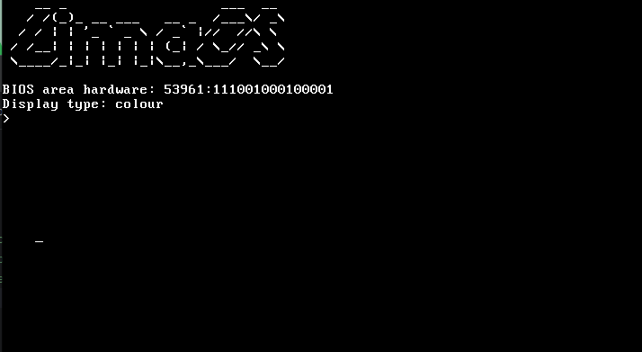

# limaOS
An experimental x86 OS written on C just for fun.



# Building and running
> Now supported only img building.

Build all variants of binaries:

```bash
make build
```

Build and run img binary on Qemu
```bash
make run-img
```

Build and run iso binary on Qemu
```bash
make run-img
```

# Debugging
Build and debug with gdb
```bash
make debug-img
#or
make debug-iso
```